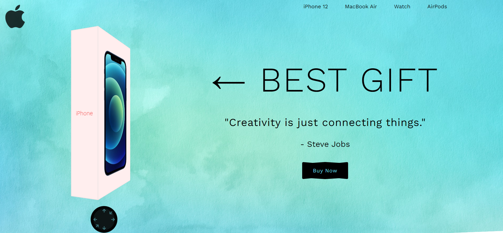

# Apple eCommerce Website

This project is a simple Apple eCommerce website showcasing the iPhone 12. It includes a product details section that fetches data from a JSON file.

## Table of Contents

- [Demo](#demo)
- [Features](#features)
- [Installation](#installation)

## Demo

### [Live Site](https://ehasan8115.github.io/apple-product-page/)



## Features

- Modern and responsive design
- Cube animation for the iPhone display
- Product details section with data fetched from a JSON file
- Beautifully styled product details

## Installation

1. Clone the repository:

   ```bash
   git clone https://github.com/your-username/apple-ecommerce.git
